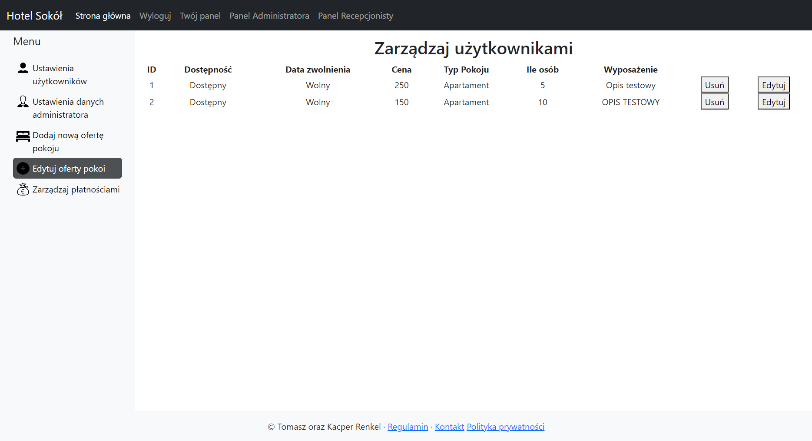
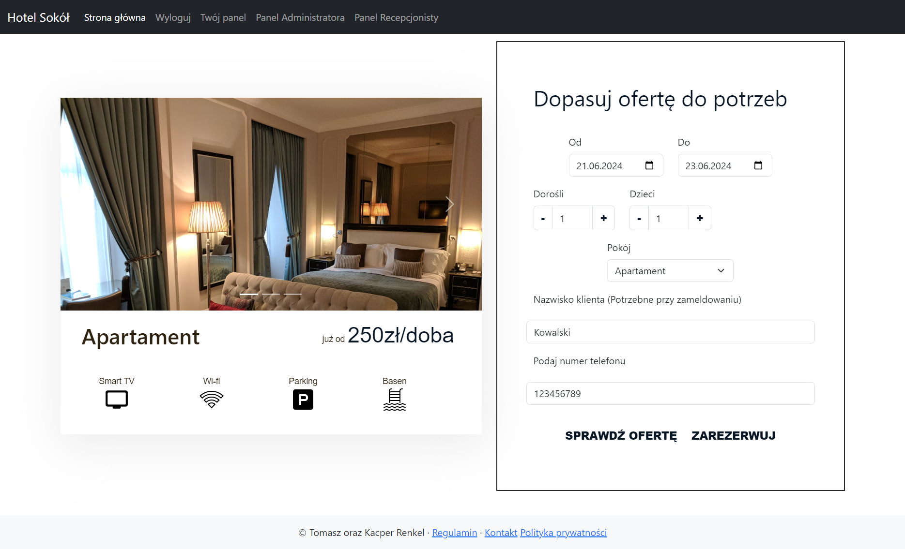

# Hotel reservation management

[](https://opensource.org/license/MIT)

## Table Of Content

- [Description](#description)

- [Installation](#installation)

- [GitHub](#github)
- [Contact](#contact)
- [License](#license)


## Description

The motivation was the desire to expand my knowledge, learn Spring, and explore new frameworks. The application helps manage reservations to avoid misunderstandings related to bookings.

<p align="center">
  <br>
Main Page
</p>
<p align="center">
  <br>
Admin Panel
</p>
<p align="center">
  <br>
Reservation Page
</p>

## Installation

```jsx

cd frontend
```

```jsx

npm install
```

```jsx

npm start
```

Hotel reservation management is built with the following tools and libraries: <ul><li>React</li> <li>Bootstrap</li> <li>Spring Boot</li> <li>MySQL</li> <li>Flyway</li> <li>Mapstruct</li> <li>Lombok</li></ul>

## GitHub

<a href="https://github.com/kacper0276"><strong>kacper0276</a></strong>
<a href="https://github.com/Tomasz2002"><strong>Tomasz2002</a></strong>

## Contact

Feel free to reach out to me on my email:
kacper0276@op.pl

## License

[](https://opensource.org/license/MIT)
